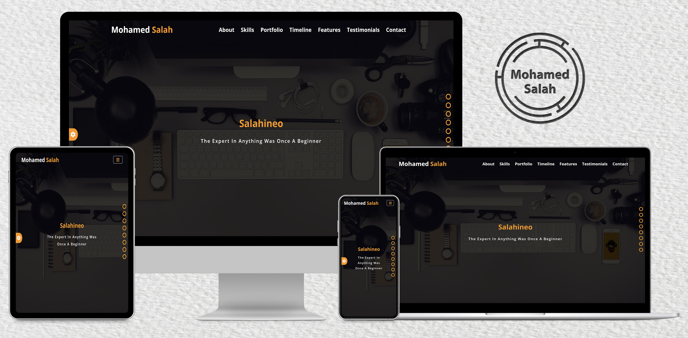

<h1 align="center">Advanced Resume</h1>

## modules use

- [Goal](#goal)
- [Benefits](#benefits)
- [Demo](#demo)
- [Technologies](#technologies)
- [Contact](#contact)
- [Copyright and license](#copyright-and-license)

### Goal

This is an advanced resume web design. I coded this project to practice on my knowledge of HTML, CSS, JavaScript, and jQuery in a real project.

### Benefits

Here are some ideas to benefit from this project:

- Take this project as a task and try to make it, and if you could not do a specific section, see how I make it in the source code (use comments to reach this section).
- Extract a code of a specific section and use it in your project.
- Review source code to see how other people code their projects.
- Edit on this project after studying its code well, to know how to work in pair-programming with other people
- Upgrade this project, and add your own sections or pages

### Demo

Here is the demo of this [project](https://salahineo.github.io/Advanced-Resume/)

### Technologies

- HTML
- CSS
- JavaScript
- jQuery

> This project is fully responsive

### Contact

